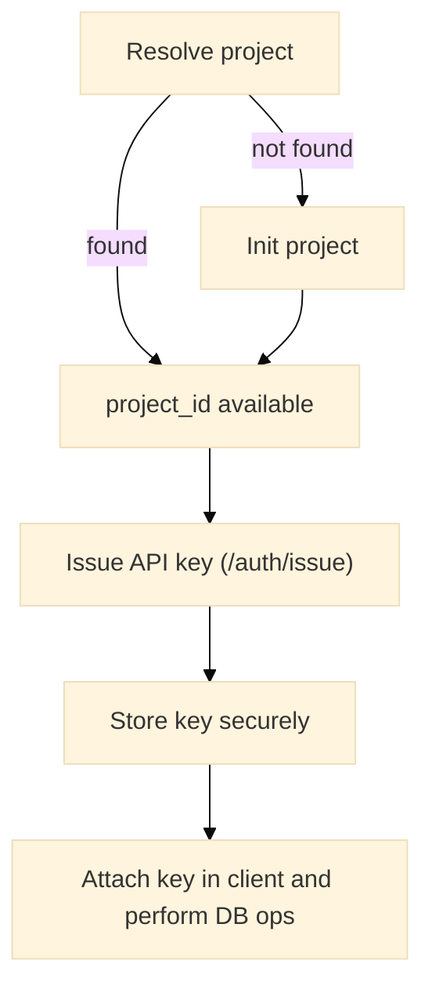

# Authentication

This page describes authentication mechanics for the Warlot Go SDK: header requirements, API key issuance, lifecycle, and recommended handling patterns.

---

## Header model

All database operations require the following HTTP headers. The SDK attaches them automatically when the corresponding fields are configured on `Client`.

| Header           | Source in SDK        | Purpose                                          |
| ---------------- | -------------------- | ------------------------------------------------ |
| `x-api-key`      | `Client.APIKey`      | Authenticates database operations for a project. |
| `x-holder-id`    | `Client.HolderID`    | Identifies the holder address.                   |
| `x-project-name` | `Client.ProjectName` | Identifies the human-readable project name.      |
| `Content-Type`   | SDK (fixed)          | Always `application/json`.                       |
| `User-Agent`     | `Client.UserAgent`   | Identifies the SDK (customizable).               |

> Notes
> • Header names are case-insensitive over HTTP.
> • API key redaction is applied by the SDK in optional logs to prevent leakage.

---

## Key issuance flow

API keys are issued per project via the `/auth/issue` endpoint. Typical lifecycle:



---

## Minimal example

```go
import (
	"context"
	"github.com/warlot-lab/warlot-golang-sdk/warlot-go/warlot"
)

func example(ctx context.Context) error {
	cl := warlot.New(
		warlot.WithHolderID("0xHOLDER..."),
		warlot.WithProjectName("project_name"),
	)

	// Resolve or initialize
	r, _ := cl.ResolveProject(ctx, warlot.ResolveProjectRequest{
		HolderID: "0xHOLDER...", ProjectName: "project_name",
	})
	projectID := r.ProjectID
	if projectID == "" {
		initRes, err := cl.InitProject(ctx, warlot.InitProjectRequest{
			HolderID: "0xHOLDER...", ProjectName: "project_name",
			OwnerAddress: "0xOWNER...", IncludePass: true, Deletable: true,
		})
		if err != nil { return err }
		projectID = initRes.ProjectID
	}

	// Issue API key
	iss, err := cl.IssueAPIKey(ctx, warlot.IssueKeyRequest{
		ProjectID: projectID,
		ProjectHolder: "0xHOLDER...",
		ProjectName: "project_name",
		User: "0xOWNER...",
	})
	if err != nil { return err }

	// Attach key for subsequent calls
	cl.APIKey = iss.APIKey

	// Auth headers are now auto-applied for SQL/table/status/commit calls.
	_, err = cl.ExecSQL(ctx, projectID, warlot.SQLRequest{
		SQL: "SELECT 1", Params: nil,
	})
	return err
}
```

---

## Error semantics

The API returns standard HTTP statuses; the SDK exposes a structured `APIError` for non-2xx responses.

| Status                  | Meaning (auth context)          | Typical cause                             |
| ----------------------- | ------------------------------- | ----------------------------------------- |
| `401 Unauthorized`      | Missing or invalid `x-api-key`  | Key not issued or expired/invalid         |
| `403 Forbidden`         | Access denied for project scope | Holder/project mismatch                   |
| `429 Too Many Requests` | Rate limit exceeded             | Backoff required; SDK retries with jitter |
| `5xx`                   | Transient server error          | Retry advisable; SDK retries with jitter  |

Programmatic handling example:

```go
if err != nil {
	if e, ok := err.(*warlot.APIError); ok {
		switch e.StatusCode {
		case 401, 403:
			// Re-issue key, confirm holder/project headers, or halt.
		case 429:
			// Request was retried; consider backoff tuning or idempotency keys for writes.
		}
	}
}
```

---

## Types (definition)

Key issuance request/response and relevant client fields/options.

```go
// Client fields relevant to auth.
type Client struct {
	BaseURL     string
	APIKey      string     // sent as x-api-key
	HolderID    string     // sent as x-holder-id
	ProjectName string     // sent as x-project-name
	// ...
}

// Construction-time options.
type Option func(*Client)
func WithAPIKey(k string) Option
func WithHolderID(h string) Option
func WithProjectName(n string) Option
func WithUserAgent(ua string) Option

// Issuance request/response.
type IssueKeyRequest struct {
	ProjectID     string `json:"projectId"`
	ProjectHolder string `json:"projectHolder"`
	ProjectName   string `json:"projectName"`
	User          string `json:"user"`
}
type IssueKeyResponse struct {
	APIKey string `json:"apiKey"`
	URL    string `json:"url"`
}
```

---

## Security guidance (summary)

* **Secret storage:** API keys should be stored in a secure secret manager or environment variable with least-privilege access at runtime.
* **Redaction:** the SDK redacts `x-api-key` values in log hooks; avoid printing raw keys.
* **Rotation:** re-issue keys when compromised or per rotation policy; update `Client.APIKey` immediately.
* **Idempotency:** apply `WithIdempotencyKey` for write operations to prevent duplicate effects during retries.

---

## Unit test definition (headers applied)

A compact test that asserts correct auth headers are forwarded. Uses a stub server.

```go
// authentication_headers_test.go (package warlot)
package warlot

import (
	"context"
	"net/http"
	"net/http/httptest"
	"testing"
)

func Test_AuthHeaders_Applied(t *testing.T) {
	s := httptest.NewServer(http.HandlerFunc(func(w http.ResponseWriter, r *http.Request) {
		if r.Header.Get("x-api-key") == "" { t.Errorf("missing x-api-key") }
		if r.Header.Get("x-holder-id") == "" { t.Errorf("missing x-holder-id") }
		if r.Header.Get("x-project-name") == "" { t.Errorf("missing x-project-name") }
		w.Header().Set("Content-Type", "application/json")
		w.WriteHeader(200)
		_, _ = w.Write([]byte(`{"ok":true,"row_count":0}`))
	}))
	defer s.Close()

	cl := New(
		WithBaseURL(s.URL),
		WithAPIKey("k"),
		WithHolderID("h"),
		WithProjectName("p"),
	)
	_, err := cl.ExecSQL(context.Background(), "proj", SQLRequest{SQL: "CREATE TABLE t(x)", Params: nil})
	if err != nil {
		t.Fatalf("ExecSQL failed: %v", err)
	}
}
```

---

## E2E test definition (issuance)

Skips unless explicitly enabled via environment.

```go
// authentication_e2e_test.go (package e2e)
package e2e

import (
	"context"
	"net/http"
	"os"
	"testing"
	"time"

	"github.com/warlot-lab/warlot-golang-sdk/warlot-go/warlot"
)

func Test_IssueKey_And_SQL_Live(t *testing.T) {
	if os.Getenv("WARLOT_E2E") != "1" {
		t.Skip("enable with WARLOT_E2E=1")
	}
	holder := mustEnv(t, "WARLOT_HOLDER")
	owner := mustEnv(t, "WARLOT_OWNER")
	pname := mustEnv(t, "WARLOT_PNAME")

	cl := warlot.New(
		warlot.WithHolderID(holder),
		warlot.WithProjectName(pname),
		warlot.WithHTTPClient(&http.Client{Timeout: 120 * time.Second}),
		warlot.WithRetries(6),
	)

	ctx := context.Background()
	// resolve or init
	r, _ := cl.ResolveProject(ctx, warlot.ResolveProjectRequest{HolderID: holder, ProjectName: pname})
	projectID := r.ProjectID
	if projectID == "" {
		ir, err := cl.InitProject(ctx, warlot.InitProjectRequest{
			HolderID: holder, ProjectName: pname, OwnerAddress: owner,
			IncludePass: true, Deletable: true,
		})
		if err != nil { t.Fatal(err) }
		projectID = ir.ProjectID
	}

	iss, err := cl.IssueAPIKey(ctx, warlot.IssueKeyRequest{
		ProjectID: projectID, ProjectHolder: holder, ProjectName: pname, User: owner,
	})
	if err != nil { t.Fatal(err) }

	cl.APIKey = iss.APIKey
	if _, err := cl.ExecSQL(ctx, projectID, warlot.SQLRequest{SQL: "SELECT 1", Params: nil}); err != nil {
		t.Fatal(err)
	}
}

func mustEnv(t *testing.T, k string) string {
	t.Helper()
	v := os.Getenv(k)
	if v == "" { t.Fatalf("missing %s", k) }
	return v
}
```

---

## CLI note

The `warlotctl issue-key` command mirrors the issuance flow and can be used to validate credentials outside application code. See `11-cli.md` for command flags and environment variables.
