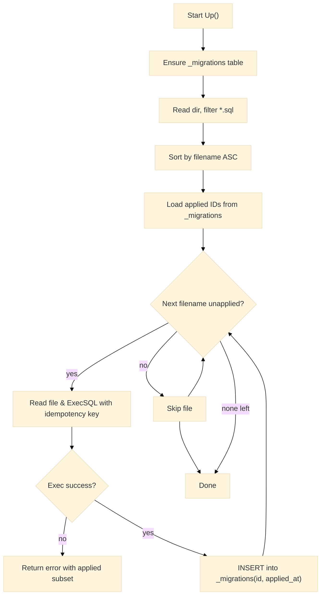

# Migrations

Schema changes are applied through a minimal migration facility built into the SDK. This page explains directory layout, execution order, idempotency behavior, ledger tracking, embedding, and error handling. Type and test definitions are included.

---

## Overview

* **Runner:** `Migrator.Up(ctx, project, fsys, dir)` reads `.sql` files from `dir`, sorts by filename, skips previously applied entries, and executes pending scripts in order.
* **Ledger:** Applied migrations are recorded in `_migrations (id TEXT PRIMARY KEY, applied_at TEXT)`.
* **Idempotency:** Each script is executed with an idempotency key (`x-idempotency-key: mig-<filename>`).
* **Resumability:** If an error occurs, earlier successful scripts remain recorded; a subsequent run continues from the first unapplied file.

---

## Flow



---

## Directory layout and naming

A deterministic, lexicographic ordering is applied. A common convention is:

```
migrations/
  0001_init.sql
  0002_add_products.sql
  0003_add_index_products_name.sql
```

**Guidelines**

* Use zero-padded numeric prefixes for stable ordering.
* Prefer **one DDL change per file** to simplify error isolation.
* Keep scripts **idempotent** where practical (`CREATE TABLE IF NOT EXISTS …`, `CREATE INDEX IF NOT EXISTS …`).

---

## Embedding migrations (recommended)

Go’s `embed` package allows bundling migration files into the binary.

```go
// migrations.go
package data

import "embed"

//go:embed migrations/*.sql
var Files embed.FS
```

Execution:

```go
import (
	"context"
	"time"

	"github.com/warlot-lab/warlot-golang-sdk/warlot-go/warlot"
	"myapp/data"
)

func applyMigrations(ctx context.Context, client *warlot.Client, projectID string) error {
	ctx, cancel := context.WithTimeout(ctx, 2*time.Minute)
	defer cancel()

	p := client.Project(projectID)
	var m warlot.Migrator
	_, err := m.Up(ctx, p, data.Files, "migrations")
	return err
}
```

---

## Example SQL files

`0001_init.sql`

```sql
CREATE TABLE IF NOT EXISTS products (
  id INTEGER PRIMARY KEY AUTOINCREMENT,
  name TEXT NOT NULL,
  price REAL,
  created_at DATETIME DEFAULT CURRENT_TIMESTAMP
);
```

`0002_index_name.sql`

```sql
CREATE INDEX IF NOT EXISTS idx_products_name ON products(name);
```

> Multiple statements in a single file are accepted by the migrator, but backend support for multi-statement execution may vary by gateway configuration. Prefer one statement per file for portability.

---

## API and types (definition)

```go
// Migration runner (stateless).
type Migrator struct{}

// Applies .sql files from fsys under dir, in filename order.
// Creates the ledger table `_migrations` if absent.
// Returns the list of filenames applied in this run.
func (Migrator) Up(
    ctx context.Context,
    p warlot.Project,
    fsys fs.FS,
    dir string,
) (applied []string, err error)
```

**Ledger schema**

| Column       | Type             | Notes                             |
| ------------ | ---------------- | --------------------------------- |
| `id`         | TEXT PRIMARY KEY | Filename of the applied migration |
| `applied_at` | TEXT             | RFC3339 timestamp (UTC)           |

**Headers**

* Each file execution uses `x-idempotency-key: mig-<filename>`.

---

## Operational guidance

* **Time bounds:** wrap `Up` with a context that reflects operational SLOs (for example, 2–10 minutes).
* **Idempotency:** keep scripts safe to re-run where feasible. The ledger prevents duplication, but **idempotent SQL** guards against partially applied external effects.
* **Observability:** enable the SDK logger if auditability is required; headers are redacted automatically for secrets.
* **Error recovery:** after an error, fix the failing script and re-run `Up`; previously applied scripts remain recorded and are skipped.
* **Change review:** prefer small, frequent migration files to simplify troubleshooting.

---

## End-to-end example

```go
// Assemble client and project
cl := warlot.New(
    warlot.WithHolderID("0x..."),
    warlot.WithProjectName("catalog"),
)
ctx := context.Background()
res, _ := cl.ResolveProject(ctx, warlot.ResolveProjectRequest{HolderID: "0x...", ProjectName: "catalog"})
projectID := res.ProjectID // initialize first if empty

// Issue key once per project and attach to client
key, _ := cl.IssueAPIKey(ctx, warlot.IssueKeyRequest{
    ProjectID: projectID, ProjectHolder: "0x...", ProjectName: "catalog", User: "0x...",
})
cl.APIKey = key.APIKey

// Apply migrations
var m warlot.Migrator
applied, err := m.Up(ctx, cl.Project(projectID), data.Files, "migrations")
if err != nil { /* handle */ }
_ = applied // list of applied filenames in this run
```

---

## Test definitions

### 1) Creates ledger and applies pending files

```go
// migrations_create_and_apply_test.go (package warlot)
package warlot

import (
	"context"
	"embed"
	"net/http"
	"net/http/httptest"
	"strings"
	"testing"
)

//go:embed testdata/mig/*.sql
var migFS embed.FS

func Test_Migrations_CreateLedger_AndApply(t *testing.T) {
	var seenExec []string
	s := httptest.NewServer(http.HandlerFunc(func(w http.ResponseWriter, r *http.Request) {
		switch {
		case strings.HasPrefix(r.URL.Path, "/warlotSql/projects/PROJ/sql"):
			w.Header().Set("Content-Type", "application/json")
			w.WriteHeader(200)
			seenExec = append(seenExec, r.Method+" "+r.URL.Path)
			w.Write([]byte(`{"ok":true,"row_count":0}`))
		default:
			w.WriteHeader(200)
			w.Write([]byte(`{}`))
		}
	}))
	defer s.Close()

	cl := New(WithBaseURL(s.URL))
	p := cl.Project("PROJ")

	var m Migrator
	applied, err := m.Up(context.Background(), p, migFS, "testdata/mig")
	if err != nil {
		t.Fatalf("Up failed: %v", err)
	}
	if len(applied) == 0 {
		t.Fatalf("expected at least one file applied")
	}
}
```

`testdata/mig/0001_init.sql` (fixture):

```sql
CREATE TABLE IF NOT EXISTS _dummy(a INT);
```

### 2) Skips already applied files

```go
// migrations_idempotent_skip_test.go (package warlot)
package warlot

import (
	"context"
	"embed"
	"encoding/json"
	"net/http"
	"net/http/httptest"
	"strings"
	"testing"
)

//go:embed testdata/mig2/*.sql
var mig2FS embed.FS

func Test_Migrations_SkipApplied(t *testing.T) {
	// Serve: (1) ensure ledger; (2) SELECT id FROM _migrations with a prior row; (3) apply only remaining files.
	type rows struct {
		OK   bool                     `json:"ok"`
		Rows []map[string]interface{} `json:"rows,omitempty"`
	}

	call := 0
	s := httptest.NewServer(http.HandlerFunc(func(w http.ResponseWriter, r *http.Request) {
		if !strings.HasSuffix(r.URL.Path, "/sql") {
			w.WriteHeader(404)
			return
		}
		w.Header().Set("Content-Type", "application/json")
		call++
		switch call {
		case 1: // CREATE TABLE IF NOT EXISTS _migrations
			w.Write([]byte(`{"ok":true,"row_count":0}`))
		case 2: // SELECT id FROM _migrations
			_ = json.NewEncoder(w).Encode(rows{
				OK: true,
				Rows: []map[string]interface{}{
					{"id": "0001_init.sql"},
				},
			})
		default:
			// applying remaining file(s)
			w.Write([]byte(`{"ok":true,"row_count":0}`))
		}
	}))
	defer s.Close()

	cl := New(WithBaseURL(s.URL))
	p := cl.Project("P")
	var m Migrator
	applied, err := m.Up(context.Background(), p, mig2FS, "testdata/mig2")
	if err != nil {
		t.Fatalf("Up failed: %v", err)
	}
	// Only files other than 0001_init.sql should be applied.
	for _, f := range applied {
		if f == "0001_init.sql" {
			t.Fatalf("unexpected reapply of %s", f)
		}
	}
}
```

Fixtures:

`testdata/mig2/0001_init.sql`

```sql
CREATE TABLE IF NOT EXISTS alpha(x INT);
```

`testdata/mig2/0002_more.sql`

```sql
CREATE TABLE IF NOT EXISTS beta(y INT);
```

### 3) Propagates error and returns partial list

```go
// migrations_error_propagation_test.go (package warlot)
package warlot

import (
	"context"
	"errors"
	"net/http"
	"net/http/httptest"
	"testing"
)

func Test_Migrations_ErrorPropagation(t *testing.T) {
	step := 0
	s := httptest.NewServer(http.HandlerFunc(func(w http.ResponseWriter, r *http.Request) {
		step++
		if step == 1 { // ensure ledger
			w.WriteHeader(200)
			w.Write([]byte(`{"ok":true,"row_count":0}`))
			return
		}
		if step == 2 { // SELECT existing
			w.WriteHeader(200)
			w.Write([]byte(`{"ok":true,"rows":[]}`))
			return
		}
		// fail on first apply
		http.Error(w, `{"message":"syntax error"}`, 400)
	}))
	defer s.Close()

	cl := New(WithBaseURL(s.URL))
	p := cl.Project("P")
	fs := fstestMap(map[string]string{
		"m/0001.sql": "CREATE TABLE t(x INT)",
	})
	var m Migrator
	_, err := m.Up(context.Background(), p, fs, "m")
	if err == nil {
		t.Fatalf("expected error")
	}
	var apiErr *APIError
	if !errors.As(err, &apiErr) {
		t.Fatalf("expected APIError, got %T", err)
	}
}

// fstestMap is a tiny in-memory fs for testing only.
type fstestMap map[string]string

func (m fstestMap) Open(name string) (http.File, error) { return nil, errors.New("not implemented") }
```

*(In production tests, prefer `testing/fstest` or `embed.FS` for file fixtures.)*

---

## Troubleshooting

| Symptom                        | Likely cause                                | Action                                                                 |
| ------------------------------ | ------------------------------------------- | ---------------------------------------------------------------------- |
| No files applied               | Directory path incorrect or no `.sql` files | Confirm `dir` argument; verify file suffix and casing                  |
| Re-application of a migration  | Ledger not created or not writable          | Check permissions and SQL for `CREATE TABLE IF NOT EXISTS _migrations` |
| Failure in the middle of a run | SQL syntax or incompatible statement        | Fix script and re-run; earlier successes remain recorded               |
| Large script times out         | Request timeout too low                     | Increase request timeout on `http.Client` or overall context deadline  |

---

## Related topics

* SQL execution model and idempotency: `06-sql.md`
* Streaming and pagination: `07-streaming-pagination.md`
* Error handling and retry policy: `09-errors.md`, `10-retries-rate-limits.md`
