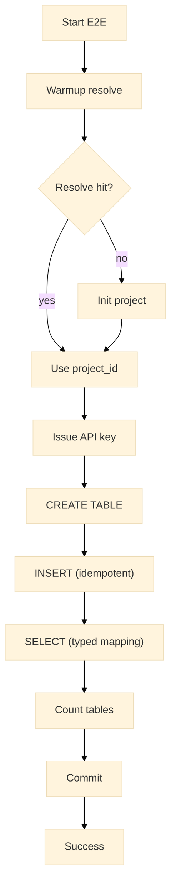

# Testing

This section defines the test strategy for the Warlot Go SDK, including tiers (unit, integration with stubs, live end-to-end), environment setup, execution commands, fixtures, CI guidance, and troubleshooting. Representative test/type definitions are included where helpful.

---

## Test tiers

| Tier                      | Purpose                                                                                     | Scope                                                  | Network           |
| ------------------------- | ------------------------------------------------------------------------------------------- | ------------------------------------------------------ | ----------------- |
| **Unit**                  | Validate request building, header forwarding, JSON decoding, retries/backoff logic          | `httptest.Server` stubs, synthetic payloads            | No external calls |
| **Integration (stubbed)** | Exercise higher-level flows (migrations, pagination, streaming) against controlled handlers | State machines in test handlers                        | No external calls |
| **Live E2E**              | Verify end-to-end behavior against the hosted API                                           | Resolve/init, issue key, DDL/DML/SELECT, count, commit | External (opt-in) |

---

## Layout

Recommended Go-conventional layout places tests beside package code and static fixtures under `testdata/`.

```
warlot/
  client.go
  http.go
  ...
  headers_test.go
  projects_test.go
  sql_test.go
  ...
  testdata/
    golden/
      resolve_legacy.json
      select_rows.json
```

* **Golden files**: JSON payloads used for deterministic comparisons.
* **Fixtures**: additional static files (for example, small `.sql` migration scripts).

---

## Running tests

### Unit & stubbed integration

```bash
# from repository root
go test ./warlot -v
go test ./warlot -v -race
go test ./warlot -v -run 'Retry|Headers|SQL'
```

Coverage:

```bash
go test ./warlot -coverprofile=cover.out
go tool cover -func=cover.out
go tool cover -html=cover.out
```

Disable test result caching when required:

```bash
go test ./warlot -v -count=1
```

### Live E2E (opt-in)

```bash
export WARLOT_E2E=1
export WARLOT_BASE_URL=https://warlot-api.onrender.com   # optional; SDK default is used if absent
export WARLOT_HOLDER=0x....
export WARLOT_OWNER=0x....
export WARLOT_PNAME=project_name_for_test

go test ./warlot -v -run TestE2E_Live -count=1
```

**Timeouts**: E2E test uses generous per-step timeouts (for example, resolve/init: up to 3m). Adjust by editing the test if necessary.

---

## E2E flow



---

## Common test patterns

### 1) `httptest.Server` stub with state

```go
s := httptest.NewServer(http.HandlerFunc(func(w http.ResponseWriter, r *http.Request) {
	switch {
	case r.Method == "POST" && strings.HasSuffix(r.URL.Path, "/sql"):
		w.Header().Set("Content-Type", "application/json")
		w.WriteHeader(200)
		w.Write([]byte(`{"ok":true,"row_count":1}`))
		return
	case r.URL.Path == "/warlotSql/projects/resolve":
		w.Header().Set("Content-Type", "application/json")
		w.Write([]byte(`{"ProjectID":"P-1","DBID":"DB-1"}`)) // legacy shape
		return
	default:
		http.NotFound(w, r)
	}
}))
defer s.Close()

cl := New(WithBaseURL(s.URL))
```

### 2) Simulating `429` with `Retry-After`

```go
var first int32
s := httptest.NewServer(http.HandlerFunc(func(w http.ResponseWriter, r *http.Request) {
	if atomic.AddInt32(&first, 1) == 1 {
		w.Header().Set("Retry-After", "1")
		http.Error(w, `{"message":"rate limited"}`, http.StatusTooManyRequests)
		return
	}
	w.Header().Set("Content-Type", "application/json")
	w.Write([]byte(`{"ok":true,"row_count":0}`))
}))
defer s.Close()

cl := New(WithBaseURL(s.URL), WithRetries(2))
_, err := cl.ExecSQL(context.Background(), "P", SQLRequest{SQL: "CREATE TABLE t(x)"})
```

### 3) Streaming rows (chunked/malformed)

```go
s := httptest.NewServer(http.HandlerFunc(func(w http.ResponseWriter, r *http.Request) {
	w.Header().Set("Content-Type", "application/json")
	fl, _ := w.(http.Flusher)
	io.WriteString(w, `{"ok":true,"rows":[`)
	io.WriteString(w, `{"id":1}`)
	io.WriteString(w, `,{"id":2}`)
	fl.Flush()
	// end properly or omit closing bracket to trigger error
	io.WriteString(w, `]}`)
}))
defer s.Close()

cl := New(WithBaseURL(s.URL))
sc, _ := cl.ExecSQLStream(context.Background(), "P", SQLRequest{SQL: "SELECT * FROM t"})
defer sc.Close()

var row map[string]any
for sc.Next(&row) { /* consume */ }
_ = sc.Err() // non-nil if JSON malformed
```

### 4) Golden file comparison

```go
want, _ := os.ReadFile("testdata/golden/select_rows.json")
got := mustMarshal(t, SQLResponse{OK: true, Rows: []map[string]any{{"id": 1}}})
if !jsonEqual(got, want) {
    t.Fatalf("mismatch\nwant: %s\ngot:  %s", string(want), string(got))
}
```

---

## Tests included (reference)

| File                           | Focus                                              |
| ------------------------------ | -------------------------------------------------- |
| `headers_test.go`              | Auth header forwarding and redaction               |
| `projects_test.go`             | Resolve/init/issue flows, legacy normalization     |
| `sql_test.go`                  | DDL/DML `row_count`, SELECT `rows`, typed mapping  |
| `stream_test.go`               | Streaming reader behavior, malformed JSON handling |
| `tables_status_commit_test.go` | List/browse/schema/count/status/commit coverage    |
| `migrate_test.go`              | Migration ordering, idempotency, ledger tracking   |
| `retry_ratelimit_test.go`      | `429`/`5xx` retries, `Retry-After` honoring        |
| `helper_test.go`               | Shared helpers (JSON compare, test client)         |

---

## Helper definitions (suggested)

```go
// Helper to build a client against a stub server.
func newTestClient(t *testing.T, base string, opts ...Option) *Client {
	t.Helper()
	all := append([]Option{WithBaseURL(base), WithRetries(0)}, opts...)
	return New(all...)
}

// JSON comparison tolerant of key order.
func jsonEqual(a, b []byte) bool {
	var ja, jb any
	if json.Unmarshal(a, &ja) != nil || json.Unmarshal(b, &jb) != nil {
		return false
	}
	return reflect.DeepEqual(ja, jb)
}

// Pretty marshal for diagnostics.
func mustMarshal(t *testing.T, v any) []byte {
	t.Helper()
	b, err := json.Marshal(v)
	if err != nil {
		t.Fatal(err)
	}
	return b
}
```

---

## CI guidance

A minimal GitHub Actions workflow:

```yaml
name: go-ci
on: [push, pull_request]
jobs:
  test:
    runs-on: ubuntu-latest
    strategy:
      matrix:
        go: ['1.21', '1.22', '1.23']
    steps:
      - uses: actions/checkout@v4
      - uses: actions/setup-go@v5
        with: { go-version: ${{ matrix.go }} }
      - run: go mod tidy
      - run: go build ./...
      - run: go test ./warlot -race -coverprofile=cover.out
      - run: go tool cover -func=cover.out | tee cover.txt
      # E2E disabled by default; enable with secrets/environment if desired.
```

**Optional E2E job**: gate on a label or branch, provide `WARLOT_*` secrets, and run `-run TestE2E_Live`.

---

## Flake mitigation

* Warm the `resolve` endpoint before the first E2E step.
* Use idempotency keys for writes during E2E.
* Increase `WithRetries` and backoff ceiling for live tests.
* Isolate long-running E2E in a nightly or separate workflow.

---
## Test Out put

### E2E2_Live test
```txt
--- PASS: TestE2E_Live (7.64s)
PASS
ok      github.com/warlot-lab/warlot-golang-sdk/warlot-go/e2e   7.656s
```

### Unit Local Test
```txt
    === RUN   TestHeaders_Auth_Forwarded
    --- PASS: TestHeaders_Auth_Forwarded (0.06s)
    === RUN   TestMigrator_Up
    --- PASS: TestMigrator_Up (0.00s)
    === RUN   TestProjects_Init_Issue_Resolve
    --- PASS: TestProjects_Init_Issue_Resolve (0.00s)
    === RUN   TestRetry_WithRetryAfter_ThenSuccess
    --- PASS: TestRetry_WithRetryAfter_ThenSuccess (0.21s)
    === RUN   TestSQL_DDL_DML_Select_QueryTyped_Idempotency
    --- PASS: TestSQL_DDL_DML_Select_QueryTyped_Idempotency (0.00s)
    === RUN   TestExecSQLStream_RowScanner
    --- PASS: TestExecSQLStream_RowScanner (0.00s)
    === RUN   TestTables_Status_Commit_Pager
    --- PASS: TestTables_Status_Commit_Pager (0.00s)
    PASS
    ok      github.com/warlot-lab/warlot-golang-sdk/warlot-go/warlot        0.295s
```

---

## Troubleshooting

| Symptom                                  | Likely cause                       | Resolution                                                               |
| ---------------------------------------- | ---------------------------------- | ------------------------------------------------------------------------ |
| `context deadline exceeded`              | Test timeout too strict            | Increase context or HTTP client timeout for the test                     |
| `missing required -project` in CLI tests | Flag omission                      | Provide `-project` in command invocation                                 |
| `json: cannot unmarshal …`               | Type mismatch in synthetic payload | Align stub payload with SDK expectations or switch to untyped assertions |
| E2E fails on resolve                     | Project not present                | Allow test to init; confirm `WARLOT_*` env values                        |
| Intermittent `429`                       | Rate limit during E2E              | Rely on SDK retries; reduce call rate; raise backoff maxima              |

---

## Selected unit-test definitions

### Retry then success (`5xx`)

```go
func Test_Retry_5xx_Succeeds(t *testing.T) {
	var calls int32
	s := httptest.NewServer(http.HandlerFunc(func(w http.ResponseWriter, r *http.Request) {
		if atomic.AddInt32(&calls, 1) == 1 {
			http.Error(w, `{"message":"bad gateway"}`, http.StatusBadGateway)
			return
		}
		w.Header().Set("Content-Type", "application/json")
		w.Write([]byte(`{"ok":true,"row_count":0}`))
	}))
	defer s.Close()

	cl := New(WithBaseURL(s.URL), WithRetries(1))
	if _, err := cl.ExecSQL(context.Background(), "P", SQLRequest{SQL: "CREATE TABLE t(x)"}); err != nil {
		t.Fatalf("unexpected: %v", err)
	}
}
```

### Streaming scanner reads all rows

```go
func Test_Stream_ReadsRows(t *testing.T) {
	s := httptest.NewServer(http.HandlerFunc(func(w http.ResponseWriter, r *http.Request) {
		w.Header().Set("Content-Type", "application/json")
		io.WriteString(w, `{"ok":true,"rows":[{"id":1},{"id":2},{"id":3}]}`)
	}))
	defer s.Close()

	cl := New(WithBaseURL(s.URL))
	sc, err := cl.ExecSQLStream(context.Background(), "P", SQLRequest{SQL: "SELECT 1"})
	if err != nil { t.Fatal(err) }
	defer sc.Close()

	var cnt int
	var m map[string]any
	for sc.Next(&m) { cnt++ }
	if err := sc.Err(); err != nil { t.Fatal(err) }
	if cnt != 3 { t.Fatalf("want 3, got %d", cnt) }
}
```

---

## Related documentation

* **Errors:** `09-errors.md`
* **Retries & Rate Limits:** `10-retries-rate-limits.md`
* **SQL:** `06-sql.md`
* **Streaming & Pagination:** `07-streaming-pagination.md`
* **Migrations:** `08-migrations.md`
