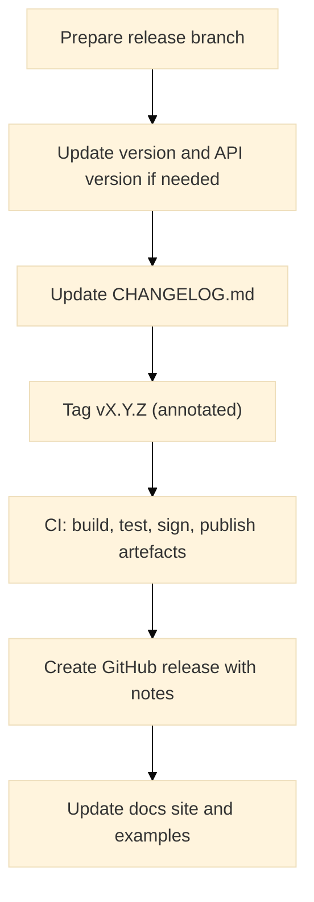

# Versioning & Changelog

This page defines the versioning policy for the Warlot Go SDK, how releases relate to API versions, deprecation timelines, recommended pinning strategies, and the changelog format. It also includes short code/test definitions to verify version constants and compatibility gates.

---

## Policies

### Semantic Versioning (SDK)

The SDK follows **SemVer**:

* **MAJOR** (`vX.y.z`): Breaking changes in public API.
* **MINOR**: Backward-compatible features and improvements.
* **PATCH**: Backward-compatible bug fixes and internal changes.

**Go Modules:** for `v2+`, the module path includes the major suffix, for example:

```
module github.com/warlot-lab/warlot-golang-sdk/warlot-go/v2
```

### API Compatibility

The Warlot SQL Database API currently publishes **API version: 1.0**. The SDK targets that version and encodes it in the default `User-Agent` string for diagnostics.

| SDK version | Target API version            | Notes                                                             |
| ----------- | ----------------------------- | ----------------------------------------------------------------- |
| `v0.2.x`    | `v1`                          | Pre-1.0 SDK; minor breaking changes possible across minor bumps.  |
| `v1.y.z`    | `v1`                          | Stable API; only MAJOR increments introduce breaking SDK changes. |
| `v2.y.z`    | `v1` (or `v2` when announced) | Major SDK with new surface or revised defaults.                   |

If the API introduces a new major version, the SDK will add explicit support behind a feature flag or new methods before switching defaults in a major SDK release.

### Deprecation

* Deprecated symbols are annotated in code comments with **“Deprecated:”** and listed in the changelog.
* A deprecation remains at least **two MINOR releases** before removal in the next **MAJOR** release.
* When possible, shims or adapters are provided to ease migration.

### Support window

* **Latest minor** on the latest two **MAJOR** lines receive security fixes and critical bug fixes.
* Earlier MAJOR lines may receive critical security patches at maintainers’ discretion.

---

## Pinning strategies

### Application code

Pin the SDK at a known good range:

```bash
go get github.com/warlot-lab/warlot-golang-sdk/warlot-go@v1.3.2
# or allow patches only:
go get github.com/warlot-lab/warlot-golang-sdk/warlot-go@v1.3
```

Use `go mod tidy` after updates. For long-lived services, prefer controlled upgrades (patches first, then minors).

### CLI

Pin a released binary by version tag or build from a specific commit. Avoid relying on `main` for production.

---

## Version constants (SDK)

A small version surface is embedded for diagnostics and `User-Agent` formation.

```go
// package warlot
package warlot

// Version is the SDK semantic version (set during releases).
const Version = "1.0.0"

// APIVersion indicates the target API major/minor used for protocol expectations.
const APIVersion = "1.0"

// UserAgentBase is combined with Version to form the default User-Agent.
const UserAgentBase = "warlot-go"

// DefaultUserAgent returns the UA used when no custom UA is provided.
func DefaultUserAgent() string {
	return UserAgentBase + "/" + Version + " (+https://github.com/warlot-lab/warlot-golang-sdk)"
}
```

The client constructor sets:

```
User-Agent: warlot-go/<SDK_VERSION> (+<repo>)
X-Warlot-API-Version: <APIVersion>     // optional; attach if the service publishes this header
```

---

## Changelog format

A single **`CHANGELOG.md`** at repository root records all notable changes in reverse chronological order. The format is based on Keep a Changelog and SemVer.

### Template

```markdown
# Changelog

All notable changes to this project are documented here. The SDK follows SemVer.

## [1.0.0] - 2025-10-03
### Added
- Initial stable release targeting API v1.0.
- CLI `warlotctl` with `resolve`, `init`, `issue-key`, `sql`, `tables`, `schema`, `count`, `status`, `commit`.
- Streaming row reader and pagination helper.
- Migrations runner with `_migrations` ledger.

### Changed
- N/A

### Fixed
- N/A

### Deprecated
- N/A

## [0.2.0] - 2025-09-28
### Added
- Retry/backoff honoring `Retry-After`.
- Idempotency header option.

### Fixed
- Flexible decoding for table count response.

[1.0.0]: https://github.com/warlot-lab/warlot-golang-sdk/releases/tag/v1.0.0
[0.2.0]: https://github.com/warlot-lab/warlot-golang-sdk/releases/tag/v0.2.0
```

**Sections**

* **Added**: New features.
* **Changed**: Backward-incompatible changes (call out migration notes here) and significant behavioral changes.
* **Fixed**: Bug fixes.
* **Deprecated**: Symbols slated for removal (include replacement guidance).
* **Removed**: Symbols removed in this version (include migration mapping).
* **Security**: Notable security fixes.

---

## Release flow



---

## Migration notes (when breaking changes occur)

Include a **Migration** subsection under each breaking release in the changelog:

* Summary of change.
* Old vs. new code snippet.
* Automated replacement hints when possible (e.g., `gofmt`/`gofix` suggestions).
* Deprecation timeline if staged.

**Example entry**

````markdown
### Changed
- ExecSQL now requires explicit `context.Context`. Callers must pass deadlines.

#### Migration
Before:
```go
res, err := client.ExecSQL("P", warlot.SQLRequest{SQL:"SELECT 1"})
````

After:

```go
res, err := client.ExecSQL(ctx, "P", warlot.SQLRequest{SQL:"SELECT 1"})
```

```

---

## Compatibility matrix

| Area | Min SDK | Notes |
|---|---|---|
| Authentication headers (`x-api-key`, `x-holder-id`, `x-project-name`) | `v0.1.0` | Stable |
| Resolve/Init/Issue Key routes | `v0.1.0` | Normalizes legacy resolve fields to modern names |
| SQL DDL/DML `{ok,row_count}` | `v0.1.0` | Stable |
| SQL SELECT `{ok,rows}` | `v0.1.0` | Stable |
| `tables/count` integer decoding | `v0.2.0` | Flexible decoding patched |
| Streaming row reader | `v0.2.0` | Stable |
| Migrations runner | `v0.2.0` | Stable |
| CLI `warlotctl` | `v0.2.0` | Stable interface documented |

---

## Git tags and module paths

- Tags must be of the form `vX.Y.Z`.
- For **v2+**, the module path includes `/v2` suffix; importers must update import paths.

**Example go.mod for v2**

```

module github.com/warlot-lab/warlot-golang-sdk/warlot-go/v2

go 1.22

````

---

## Detecting SDK version at runtime

Applications may log the SDK version during startup:

```go
log.Printf("warlot sdk=%s api=%s", warlot.Version, warlot.APIVersion)
````

---

## Tests (definitions)

### 1) Version strings follow SemVer

```go
// version_semver_test.go (package warlot)
package warlot

import (
	"regexp"
	"testing"
)

func Test_Version_IsSemVer(t *testing.T) {
	re := regexp.MustCompile(`^\d+\.\d+\.\d+(-[0-9A-Za-z\.-]+)?(\+[0-9A-Za-z\.-]+)?$`)
	if !re.MatchString(Version) {
		t.Fatalf("Version not semver: %q", Version)
	}
}
```

### 2) Default User-Agent includes version

```go
// version_useragent_test.go (package warlot)
package warlot

import "testing"

func Test_DefaultUserAgent(t *testing.T) {
	ua := DefaultUserAgent()
	if ua == "" || !containsAll(ua, []string{UserAgentBase, Version}) {
		t.Fatalf("UA missing parts: %q", ua)
	}
}
func containsAll(s string, parts []string) bool {
	for _, p := range parts {
		if !contains(s, p) { return false }
	}
	return true
}
func contains(s, sub string) bool {
	return len(sub) == 0 || (len(s) >= len(sub) && (s[:len(sub)] == sub || contains(s[1:], sub)))
}
```

### 3) APIVersion header (optional) when enabled

If an `X-Warlot-API-Version` header is attached by the HTTP layer, validate presence:

```go
// version_apiversion_header_test.go (package warlot)
package warlot

import (
	"context"
	"net/http"
	"net/http/httptest"
	"testing"
)

func Test_API_Version_Header_Propagated(t *testing.T) {
	s := httptest.NewServer(http.HandlerFunc(func(w http.ResponseWriter, r *http.Request) {
		if got := r.Header.Get("X-Warlot-API-Version"); got != APIVersion {
			t.Fatalf("missing/incorrect API version header: %q", got)
		}
		w.Write([]byte(`{"ok":true,"row_count":0}`))
	}))
	defer s.Close()

	cl := New(WithBaseURL(s.URL))
	// If the SDK conditionally includes the header, inject via per-call option for the test:
	_, err := cl.ExecSQL(context.Background(), "P",
		SQLRequest{SQL: "CREATE TABLE t(x)"},
		WithHeader("X-Warlot-API-Version", APIVersion),
	)
	if err != nil { t.Fatal(err) }
}
```

---

## Change management checklist (for maintainers)

* [ ] Update `Version`, `APIVersion`, and `DefaultUserAgent` if necessary.
* [ ] Update `CHANGELOG.md` with categorized entries and migration notes.
* [ ] Tag annotated release `vX.Y.Z`.
* [ ] Ensure CI passes on supported Go versions.
* [ ] If MAJOR bump: update `go.mod` module path and imports for `/vN`.
* [ ] Sync documentation pages that reference APIs or behavior.

---

## Related documentation

* Configuration: `04-configuration.md`
* Errors: `09-errors.md`
* Retries & rate limits: `10-retries-rate-limits.md`
* CLI: `11-cli.md`
* Types reference: `12-types.md`
